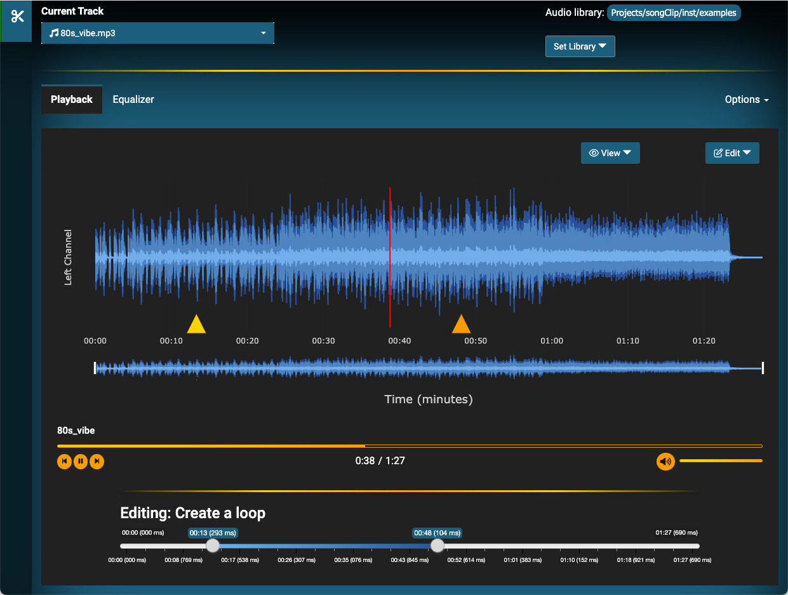

<!-- README.md is generated from README.Rmd. Please edit that file -->

```{r setup_interactive, include=FALSE}
if (interactive() || isTRUE(getOption('knitr.in.progress'))) {
  options(.songclip_initialized = TRUE)
  devtools::load_all()
}
```

```{r setup, include=FALSE}
knitr::opts_chunk$set(echo = TRUE, eval = FALSE)
```

# songClip

## Running the app

You can run the app by running the following lines. You can specify an initial audio library, as well as decide whether you want to run the app in a browser or not (defaulting to the `Rstudio` Viewer).
```{r}
library(songClip)
clip_song(audio_dir = "~/Desktop/audio_library/", browser = TRUE)
```


## Current Features
 
The list of features is constantly changing, and this readMe file may not always be up-to-date. The app has the following implemented features:
 
  - Load an audio library, allowing users to cycle through a playlist of songs or other audio files
  - Modify the view of the wave channel plot
  - Create loops
  
## Upcoming Features

The following features have yet to be implemented, but may have scaffold UIs present in the app:

 - Crop songs to save as new MP3 files
 - Cache loop settings
 - Alter playback speed while preserving the pitch
 - Equalizer (UI is set up)
 - The ability to load multiple tracks at once, with the goal of mimicking basic features of music production software.
   - Many new features would be added after this point, but better to walk before running
 
## App Preview

Main loading screen, illustrating looping and playback


#### Equalizer

The equalizer is not yet implemented, but the basic UI is set up


### Developer Notes

<details closed>
<summary>Developer Notes</summary>

#### Installation

Assuming you have `git` installed, run the following in your terminal:
```{bash}
git clone git@github.com:MLVisions/songClip.git
```
 
 - **Note for `git` noobs**: You will have to configure `git` to clone successfully. Make sure to <u>use the email you were invited with</u>.
    ```{bash}
    git config --global user.name "FIRST_NAME LAST_NAME"
    git config --global user.email "MY_NAME@example.com"
    ```

Run one the following to download all the packages:

1. If you have `r make_link("pkgr", "https://github.com/metrumresearchgroup/pkgr")` installed, run the following in your terminal:
    ```{bash}
    pkgr install
    ```

2. If not, use the following command in your `R` console. This will install all packages from the `renv.lock` file:
    ```{r}
    # install.packages("renv") # if you don't have the `renv` package
    renv::restore()
    ```

After installing all dependencies, running `devtools::load_all()` will prompt you to install any required `python` modules.

 - *Note*: `Python` is not currently needed for this package (despite the messages you will see on load), though this will likely change in the future.

</details>

